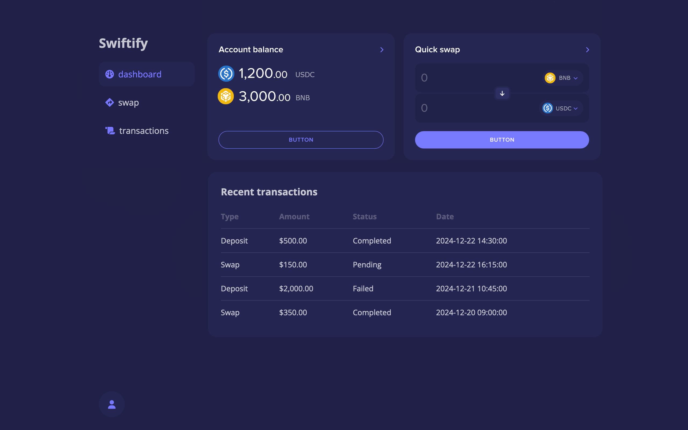

# swiftify

Swiftify is a **work in progress** React-based project that leverages custom components, a tailored theme, and styled-components to create a swap application. The application is designed to facilitate the conversion of tokens from one type to another.

## Getting Started

Follow these steps to get the project up and running:

### Clone the repository

```
git clone https://github.com/your-username/swiftify.git
```

### Navigate into the project folder

```
cd swiftify
```

### Install the dependencies

This project uses npm as a package manager. Run the following command to install all the required dependencies:

```
npm install
```

### Run the development server

After the installation is complete, you can start the development server using Vite:

```
npm run dev
```

This will start the project in development mode. Open your browser and navigate to http://localhost:8000 to view the application.

## Running Storybook

This project also includes Storybook for developing and testing UI components in isolation.

```
npm run storybook
```

# Screenshots

Below is a preview of some components from the homepage:

<p align="center">
  
</p>
<p align="center">
  <em>Dashboard Page</em>
</p>
